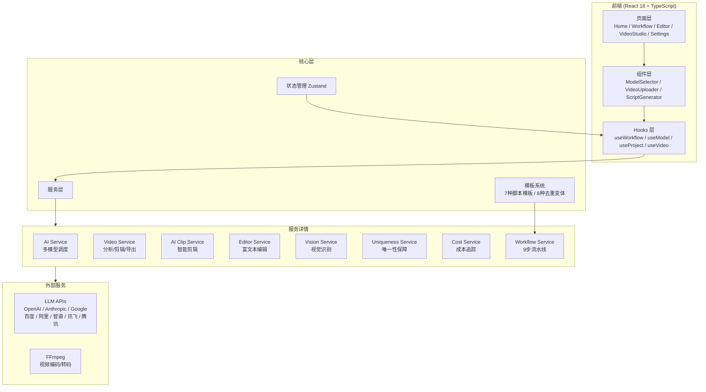

# ClipFlow 架构文档

## 系统架构



---

## 核心模块

### 1. 工作流引擎 (Workflow Service)

负责管理 9 步智能工作流的整体调度：

1. 视频上传 → 分析
2. 模板选择 → 脚本生成
3. 去重优化 → 唯一性保障
4. 脚本编辑 → 时间轴编辑
5. 导出发布

### 2. AI 服务 (AI Service)

多模型 AI 调度中心，支持 8 大 AI 提供商：

- OpenAI (GPT-5)
- Anthropic (Claude Opus 4.6)
- Google (Gemini 3)
- 百度 (ERNIE 5.5)
- 阿里 (Qwen 3.5)
- 智谱 (GLM-5)
- 讯飞 (Spark X1)
- MiniMax (MiniMax-01)

### 3. 视频服务 (Video Service)

- 视频上传与元数据提取
- 场景检测 (颜色直方图 Chi-Square 算法)
- 关键帧提取
- FFmpeg 视频编码/转码

### 4. 唯一性保障服务 (Uniqueness Service)

- 内容指纹生成
- 语义去重 (8 种变体策略)
- 唯一性检测
- 相似度超标自动重写

### 5. 成本追踪服务 (Cost Service)

- Token 用量统计
- API 调用成本计算
- 实时费用预览

---

## 数据流转

```
用户上传视频
    ↓
VideoService: 提取元数据、分辨率、时长
    ↓
VisionService: 场景检测、关键帧提取、OCR
    ↓
WorkflowService: 传递上下文给 AI Service
    ↓
AIService: 调用 LLM 生成脚本
    ↓
UniquenessService: 去重 + 唯一性保障
    ↓
EditorService: 用户编辑脚本
    ↓
TimelineService: 生成时间轴
    ↓
VideoService: FFmpeg 导出成品
```

---

## 项目结构

```
src/
├── core/                           # 核心层
│   ├── api/client.ts               # 统一 HTTP 客户端
│   ├── config/
│   │   ├── app.config.ts           # 应用配置
│   │   └── models.config.ts        # AI 模型配置
│   ├── constants/index.ts          # 全局常量
│   ├── hooks/                      # 业务 Hooks
│   │   ├── useWorkflow.ts          # 工作流管理
│   │   ├── useModel.ts             # 模型选择
│   │   ├── useProject.ts           # 项目管理
│   │   └── useVideo.ts             # 视频操作
│   ├── services/                   # 业务服务
│   │   ├── workflow.service.ts     # 9步工作流引擎
│   │   ├── ai.service.ts           # 多模型 AI 调度
│   │   ├── video.service.ts        # 视频处理 / FFmpeg
│   │   ├── aiClip.service.ts       # AI 智能剪辑
│   │   ├── vision.service.ts       # 视觉识别
│   │   ├── editor.service.ts       # 编辑器服务
│   │   ├── uniqueness.service.ts   # 唯一性保障
│   │   ├── cost.service.ts         # 成本追踪
│   │   ├── storage.service.ts      # 本地存储
│   │   └── index.ts                # 统一导出
│   ├── stores/                     # Zustand 状态管理
│   ├── templates/                  # 模板系统
│   │   ├── script.templates.ts     # 7种脚本模板
│   │   ├── dedup.templates.ts      # 去重模板
│   │   └── dedup.variants.ts       # 8种去重变体
│   └── utils/                      # 工具函数
├── components/                     # UI 组件
│   ├── business/                   # 业务组件
│   ├── common/                     # 通用组件
│   └── layout/                     # 布局组件
├── pages/                          # 页面
│   ├── Home/                       # 首页
│   ├── Workflow/                   # 工作流页面
│   ├── Editor/                     # 编辑器
│   ├── VideoStudio/                # 视频工作室
│   └── Settings/                   # 设置
└── context/                        # React Context

src-tauri/                          # Tauri 桌面端 (Rust)
docs/                               # 项目文档
```

---

## 技术栈

| 类别 | 技术 | 版本 |
|------|------|------|
| 前端框架 | React | 18.x |
| 语言 | TypeScript | 5.x |
| 构建工具 | Vite | 4.x |
| UI 组件库 | Ant Design | 5.x |
| 状态管理 | Zustand | 4.x |
| 动画 | Framer Motion | - |
| 样式 | Less + CSS Modules | - |
| 桌面端 | Tauri | 2.x |
| 视频处理 | FFmpeg | - |
| 代码规范 | ESLint + Prettier | - |

---

## 安全与性能

### 安全

- API 密钥本地存储，不上传服务器
- 敏感数据加密处理
- CSP 内容安全策略

### 性能

- 视频分段上传，支持断点续传
- 关键帧懒加载
- 服务端流式响应 (Server-Sent Events)
- 依赖预加载
